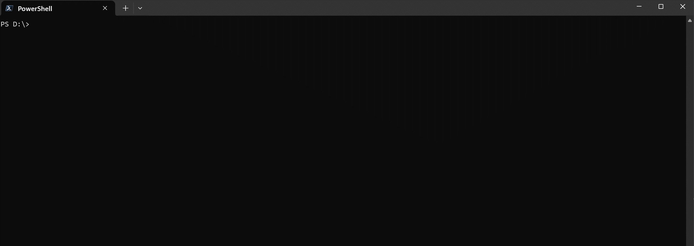

# Rua - A Smart Command Launcher
<pre align="center">English   |  <a href="https://github.com/2bitbit/rua/blob/main/README_cn.md">简体中文</a></pre>
Rua is a fast and simple terminal utility that allows you to save and quickly access your frequently used shell commands through an interactive, key-based menu.

## Demo 



## Key Features

* **Interactive TUI**: Simply run `rua` to open a clean, interactive list of your saved commands.Press the shortcut key corresponding to the command to immediately fill in the command line prompt.
* **Smart Expansion**: Displays the full, resolved path for commands (e.g., `conda` becomes `C:\Users\...\conda.exe`), so you always know exactly what will run.
* **Simple Management**: Add, remove, and list your command shortcuts with straightforward subcommands.
* **Cross-Shell Support**: Works seamlessly with PowerShell and Zsh with minimal setup.

## Installation and Setup

1. Download the Executable: Download the latest pre-compiled binary for your system from the [Releases Page](https://github.com/2bitbit/rua/releases/latest). Place the executable in a convenient location on your computer.

2. Configure Your Shell: To enable `rua` to insert the selected command into your terminal prompt, you need to add a small function to your shell's configuration file.
    * **For PowerShell**: Follow the instructions in [**scripts/pwsh.md**](https://github.com/2bitbit/rua/blob/main/scripts/pwsh.md).
    * **For Zsh**: Follow the instructions in [**scripts/zsh.md**](https://github.com/2bitbit/rua/blob/main/scripts/zsh.md).

## User Manual

The core of Rua is simple and straightforward.

| Command | Description |
|---|---|
| `rua` | (No arguments) Launches the interactive TUI. Press a shortcut key to select the corresponding command, which is then inserted into your prompt. Press `Esc` to exit. |
| `rua add <KEY> '<COMMAND>'` | Adds a new command shortcut. The key must be a single alphanumeric character. <br/>*Example: `rua add g 'git status --short'`* |
| `rua rm <KEYs>...` | Removes a command shortcut by its key. <br/>*Example: `rua rm a b c d`* |
| `rua ls` | Lists all saved commands and their expanded paths without launching the interactive TUI. |

## Building From Source

If you prefer to build the project yourself:

1. **Clone and Build**:
```sh
# Clone the repository
git clone https://github.com/2bitbit/rua.git
cd rua

# Build the release executable
cargo build --release
```
2. **Configure Shell**: Remember to follow the shell setup steps mentioned in the "Installation" section above.

<p align="center" style="color:#666666"> Colde Joke: 
Rubus means "rua 不死", in contrast to "rua 嘀死"(`Rudis`).
</p>